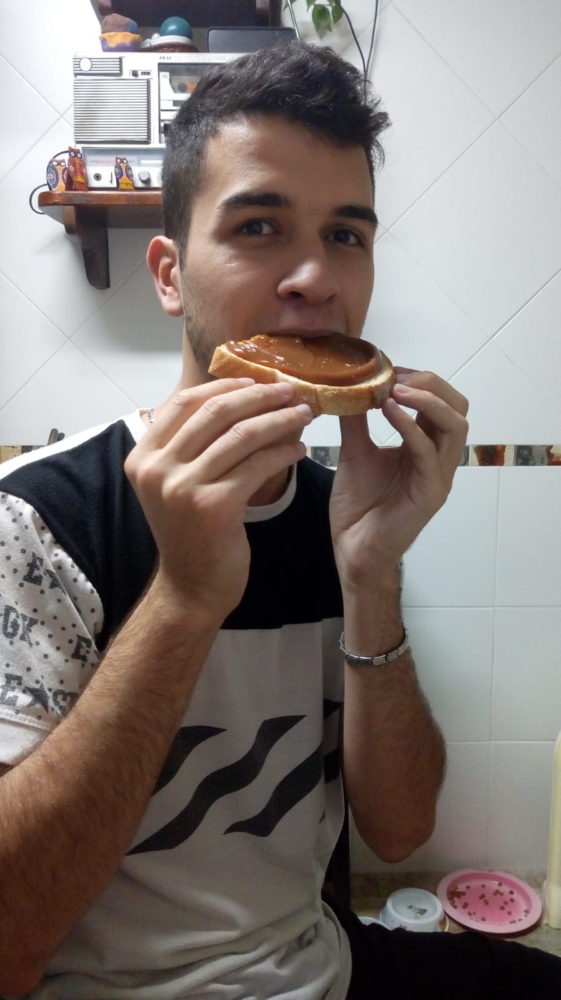

<h1>Presentación</h1>
<h3>Mi nombre es Bernardo Gabito Brodsky</h3>
<h3>Legajo: 1716530</h3>

Este es mi segundo año en la carrera y la primera vez que curso esta materia.

Me gusta jugar con la compu, suelo jugar LoL o World of Tanks también juego ajedrez. No sigo recetas para cocinar, que salga lo que salga, me gustan los gatos aunque actualmente no tengo ninguna mascota. También me gusta ver series, las siempre recomiendo son:

<ul>
	<li>Black Sails</li>
	<li>Westworld</li>
	<li>Outlander</li>
</ul>

Además de las típicas Breaking bad y Game of Thrones -hasta la temporada 6- que son must see.

La última película que ví fue Milagro en la Celda 7 y lloré bastante, me considero muy maricón para las peliculas pero no lloré con Coco.

Todos mis amigos me dicen Gabito y la gente que no me conoce piensa que me llamo Gabriel, si, es mi apellido no un apodo, pero cumple esa función.

Por último les dejo una foto mia comiendo un pan con dulce de leche. Saludos y espero que podamos volver a la facultad pronto.

